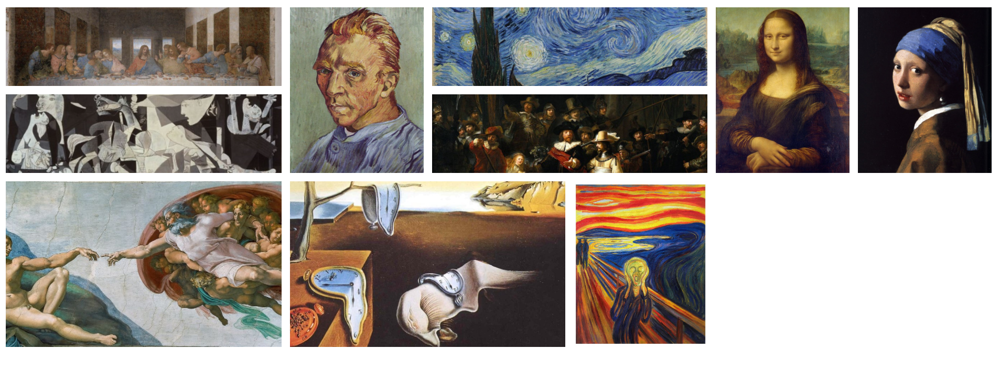
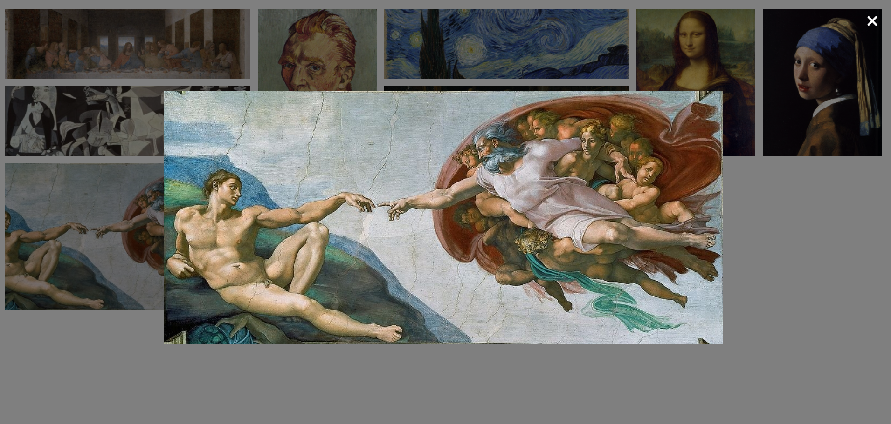
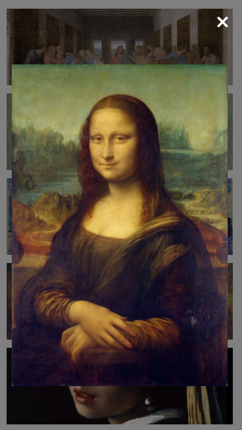

# GALLERY IMAGES
> ## Purpose
I want to challenge myself and learn new things. 

Gallery is essential for some websites so I learn and make it
> ## Desscription
Here is a challenge on FrontendMentor.io. 

I use html, css and javascript code in this project.

> ## Screenshot

***Open Modal***

***Responsive***

***Open Modal On Mobile***

